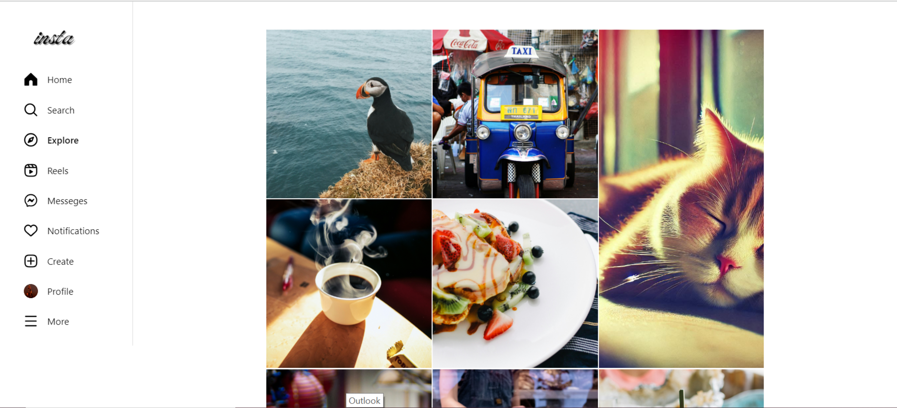
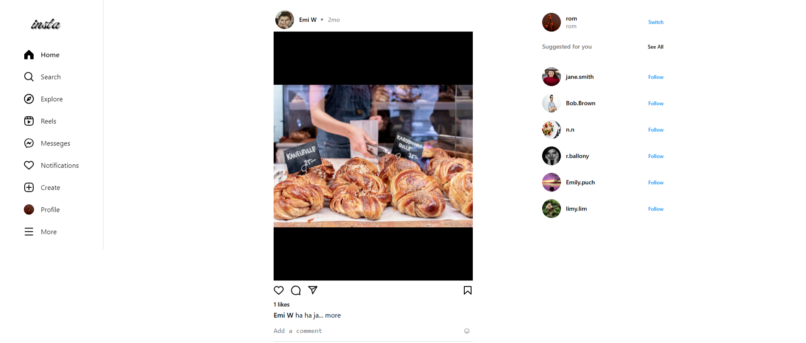
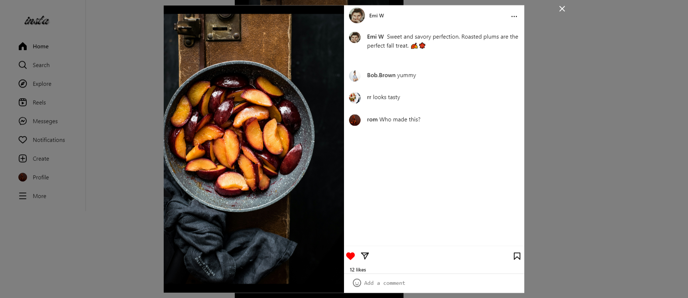
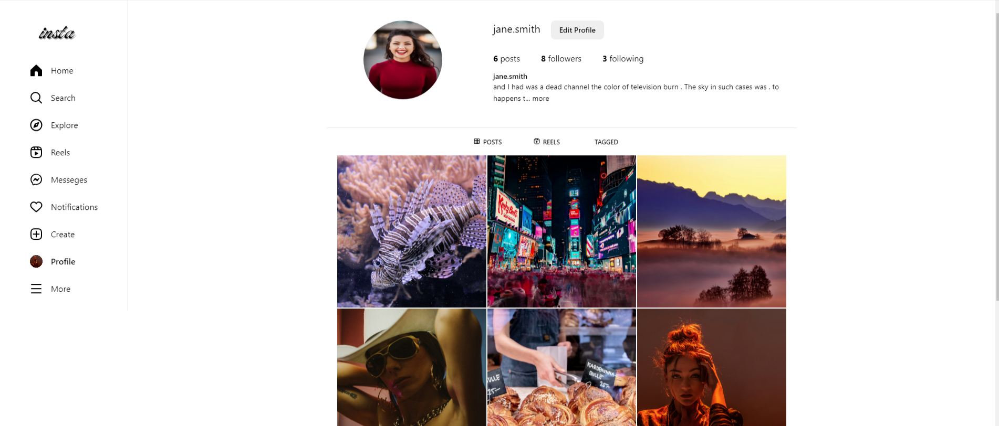
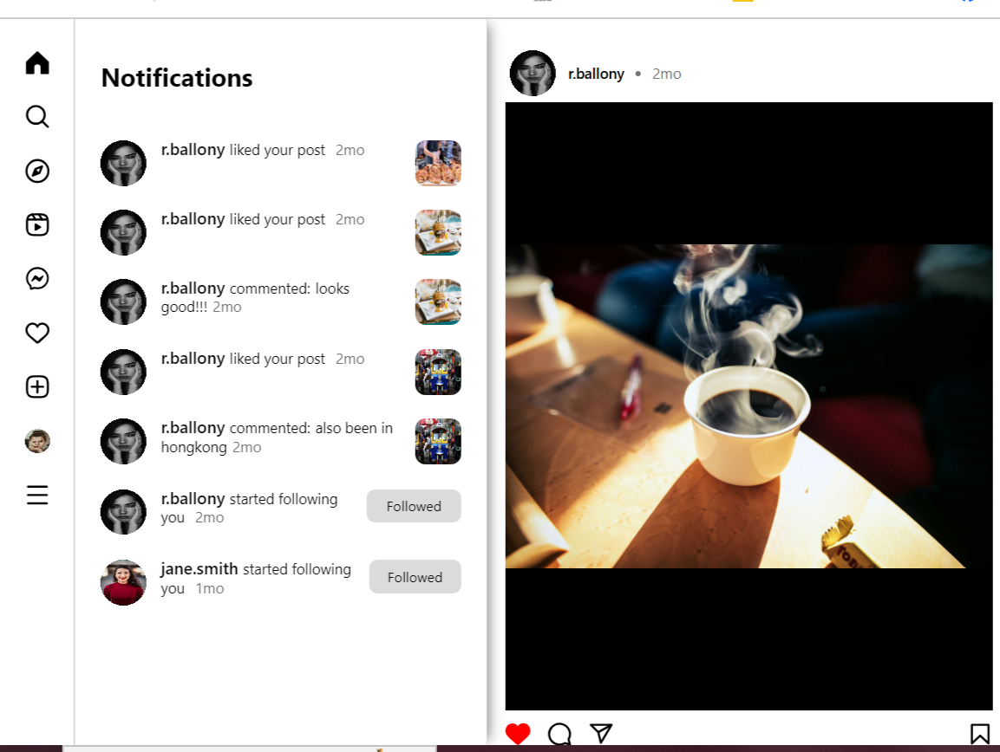
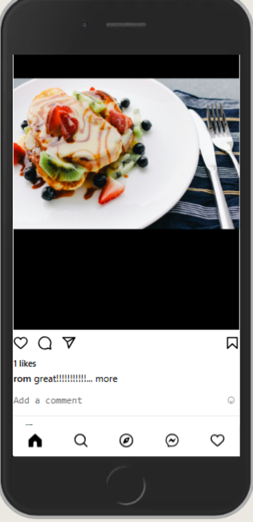
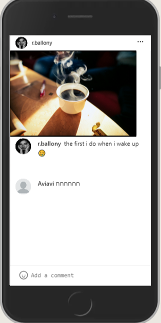
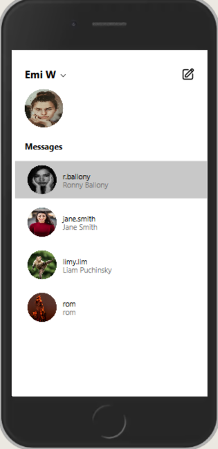

# Insta pixel perfect, E2E clone of Instagram

Insta is a social network that allows you to maintain your feed and connect with other users. It is an Instagram look-alike app implemented with React, Node.js, and MongoDB.



## Key Features

- **Feed:** Stay updated with the latest posts from users you follow.
- **Messenger:** Real-time messaging system to chat with other users using webSocket.
- **Notification System:** Get notified about new followers, likes, comments, and messages.
- **Upload Content:** Share your photos and videos with your followers.
- **Add and Edit Profile:** Customize your profile with a bio, profile picture, and personal information.
- **Following System:** Follow other users and get followed back to build your network.
- **Responsive Design:** The app is suitable for every screen layout, providing a seamless experience on mobile, tablet, and desktop devices.

## Installation and Usage Instructions

### Prerequisites

Make sure you have the following installed:
- Node.js
- npm
- MongoDB

### Steps

1. Clone the repository:
    ```
    git clone https://github.com/RomanPu/insta-back-end
    git clone https://github.com/RomanPu/insta-front-end
    ```

2. Navigate to the backend folder and install dependencies:
    ```
    npm i
    ```

3. Start the MongoDB server. Ensure MongoDB is running on your machine:
    ```
    mongod
    ```

   you can import demo data from data folder:
    ```
   1. Create a local database named `local-data`.
   2. Create the following collections: `user`, `notification`, `post`, and `message`.
   3. Import the corresponding JSON files from the `../insta-back-end/data` directory into their respective collections.
    ```

4. Start the backend server:
    ```
    npm run dev
    ```

    You should get a console output that the server is up and running at port 3030.

5. Navigate to the frontend folder and install dependencies:
    ```
    npm i
    ```

6. Start the frontend server:
    ```
    npm run dev
    ```

    The app should be running on [http://localhost:4445/](http://localhost:4445/).

## Technical Details

- **Front-end:** React, SCSS
- **Back-end:** Node.js, Express.js, MongoDB
- **Real-time Communication:** WebSocket
- **Middleware:** Custom middleware for logging and authentication
- **API:** REST API for backend

## Show case

## Insta Home Page

The Instagram Home page is the central hub where users can view posts from the accounts they follow. It features a continuous scroll of photos, videos, and stories, allowing users to engage with content through likes, comments, and shares.



## Post Detailed View

The Post Detailed View provides an in-depth look at individual posts. Users can see the full content of a post, including the caption, comments, and likes. This view allows users to engage more deeply by liking, commenting, and sharing the post. Additionally, users can see who has liked the post and view the profiles of those who have interacted with it. The Post Detailed View enhances user interaction by providing a comprehensive view of each post's engagement.



## Profile Page

The Profile Page allows users to manage their personal information and view their own posts. Users can edit their profile details, such as their bio and profile picture.  The Profile Page also provides the functionality to view other users' profiles, enabling users to explore content from different accounts and follow new users.



## Messenger

The Messenger feature allows users to communicate with each other through direct messages. The Messenger also supports real-time communication, enabling users to have instant conversations.  This feature enhances the social experience by providing a private and direct way to connect with friends and followers.


## Notification Bar

The Notification Bar keeps users informed about the latest activities and updates related to their account. It displays notifications for new likes, comments, follows, and direct messages, ensuring users stay engaged with their network. The Notification Bar is easily accessible from any page, allowing users to quickly view and interact with their notifications. This feature enhances user engagement by providing real-time updates and encouraging timely interactions with content and other users.



## Mobile Layout

The Mobile Layout is designed to provide a seamless and intuitive user experience on mobile devices. It ensures that all features, such as the Home Feed, Profile Page, Post Detailed View, and Messenger, are easily accessible and user-friendly on smaller screens. The layout adapts to different screen sizes, maintaining functionality and aesthetics. Key elements are optimized for touch interactions, and the design prioritizes readability and ease of navigation, ensuring a smooth and engaging experience for mobile users.

<div style="display: flex;
 justify-content: space-between;
 margin-top: 50px;">
  
  
  
</div>

## Contact

For more information, visit my [GitHub profile](https://github.com/RomanPu).